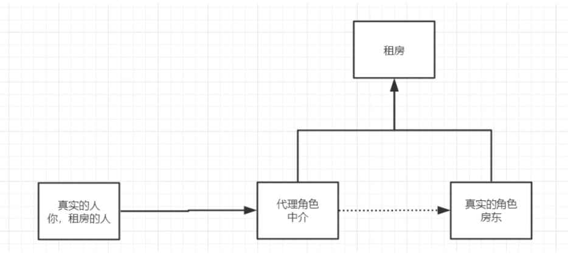

[TOC]

# Spring-Study


## 1. Ioc容器的创建及其使用

### 	1.1 新建bean文件

```java
public class user {
    private String name;

    public String getName() {
        return name;
    }

    public void setName(String name) {
        this.name = name;
    }

    public void Show()
    {
        System.out.println("name:"+name);
    }
}
```


### 	1.2 Spring元数据配置

- Ioc的配置文件需要放在`resources`目录下
- 下面的注册方式属于`属性注册`，对user对象的name属性进行注册
- 每个bean 都有一个`id`和`class`属性，id是唯一的，class需要填写对象的全限定名

```xml
<?xml version="1.0" encoding="UTF-8"?>
<beans xmlns="http://www.springframework.org/schema/beans"
       xmlns:xsi="http://www.w3.org/2001/XMLSchema-instance"
       xsi:schemaLocation="http://www.springframework.org/schema/beans http://www.springframework.org/schema/beans/spring-beans.xsd">

    <bean id="user" class="com.dao.user" >
        <property name="name" value="测试" />
    </bean>
</beans>
```


### 	1.3 实例化容器

- 提供给`ApplicationContext`构造函数的一个或多个位置路径是资源字符串，允许容器从各种外部资源（如本地文件系统、Java类路径等）加载配置元数据
- 通过`getBean`方法可获取容器中的对象，参数为`com.wwl.bean`的id
-  获取到的对象本身是个泛型，需要通过类型转换或者在`getBean`中添加具体`对象.class`

```java
ApplicationContext context = new  ClassPathXmlApplicationContext("spring-context.xml");
user u= context.getBean("user",user.class);
u.Show();
```


## 2. Spring配置说明

### 1. alias

- 在使用getBean()方法时，参数值不仅可以是`com.wwl.bean`的id，也可以是别名`alias`或`name`

```xml
<?xml version="1.0" encoding="UTF-8"?>
<beans xmlns="http://www.springframework.org/schema/beans"
       xmlns:xsi="http://www.w3.org/2001/XMLSchema-instance"
       xsi:schemaLocation="http://www.springframework.org/schema/beans http://www.springframework.org/schema/beans/spring-beans.xsd">
    
    <!-- 通过alias 属性对现有的bean对象 取个别名 -->
    <alias name="user" alias="user2" />
    <bean id="user" class="com.dao.user" > 
 		<constructor-arg name="name" value="测试" />
    </bean>  
    
</beans>
```


### 2. bean

```xml
<?xml version="1.0" encoding="UTF-8"?>
<beans xmlns="http://www.springframework.org/schema/beans"
       xmlns:xsi="http://www.w3.org/2001/XMLSchema-instance"
       xsi:schemaLocation="http://www.springframework.org/schema/beans http://www.springframework.org/schema/beans/spring-beans.xsd">
     
    <!--
		id：com.wwl.bean 的唯一标识符，也就是相当于对象名
		class：bean对象所对应的全限定名：包名+类名
		name:别名，可以取多个别名(如：name="user3,user4;user5 user6")
	-->
     <bean id="user" class="com.dao.user" name="user3"> 
 		<constructor-arg name="name" value="测试" />
    </bean>  
</beans>
```


### 3. import

- 适用于团队开发，可将多个配置文件导入合并到一个配置文件中
- bean1.xml
- bean2.xml
- spring-context.xml

```xml
<?xml version="1.0" encoding="UTF-8"?>
<beans xmlns="http://www.springframework.org/schema/beans"
       xmlns:xsi="http://www.w3.org/2001/XMLSchema-instance"
       xsi:schemaLocation="http://www.springframework.org/schema/beans http://www.springframework.org/schema/beans/spring-beans.xsd">

    <import resource="bean1.xml"/>
    <import resource="bean2.xml"/>
</beans>
```


## 3. 依赖注入


### 3.1 构造器数注入

- Ioc容器注册对象时，模式使用无参构造函数进行注册

- 假设要使用有参构造函数则需要按下面三种方式去注册
- com.wwl.bean

```java
public class user {

    public  user(String name)
    {
        this.name=name;
    }

    private String name;

    public String getName() {
        return name;
    }

    public void setName(String name) {
        this.name = name;
    }

    public void Show()
    {
        System.out.println("name:"+name);
    }
}
```


#### 3.1.1 按参数下标注入（按参数索引注入）

```xml
<?xml version="1.0" encoding="UTF-8"?>
<beans xmlns="http://www.springframework.org/schema/beans"
       xmlns:xsi="http://www.w3.org/2001/XMLSchema-instance"
       xsi:schemaLocation="http://www.springframework.org/schema/beans http://www.springframework.org/schema/beans/spring-beans.xsd">

    <bean id="user" class="com.dao.user" > 
 		<constructor-arg index="0" value="下标注入-测试" />  
    </bean> 
</beans>
```

#### 3.1.2 按参数类型注入 

```xml
<?xml version="1.0" encoding="UTF-8"?>
<beans xmlns="http://www.springframework.org/schema/beans"
       xmlns:xsi="http://www.w3.org/2001/XMLSchema-instance"
       xsi:schemaLocation="http://www.springframework.org/schema/beans http://www.springframework.org/schema/beans/spring-beans.xsd">

    <bean id="user" class="com.dao.user" > 
 		<constructor-arg type="java.lang.String" value="类型注入-测试" />
    </bean> 
</beans>
```

#### 3.1.3 按参数名称注入(推荐)

```xml
<?xml version="1.0" encoding="UTF-8"?>
<beans xmlns="http://www.springframework.org/schema/beans"
       xmlns:xsi="http://www.w3.org/2001/XMLSchema-instance"
       xsi:schemaLocation="http://www.springframework.org/schema/beans http://www.springframework.org/schema/beans/spring-beans.xsd">

    <bean id="user" class="com.dao.user" > 
 		<constructor-arg name="name" value="参数名称注入-测试" />
    </bean> 
</beans>
```


### 3.2 Set方式注入

- 依赖注入：Set注入

  - 依赖：bean对象的创建依赖于容器！
  - 注入：bean对象中的所有属性，由容器来注入

  ​    

- 注入类型：com.wwl.bean | ref | idref | list | set | map | props | value | null

- 样板：

  - com.wwl.bean

  ```java
  public class Student {
      private String name;
      private Address address;
      private String[] books;
      private List<String> hobbys;
      private Map<String,String> card;
      private Set<String> games;
      private String wife;
  }
  ```

   - xml

  ```xml
  
      <bean id="address" class="com.wwl.bean.Address"/>

      <bean id="student" class="com.wwl.bean.Student">

          <!--1.普通注入：value -->
          <property name="name" value="测试" />
  
          <!--2.Bean注入：ref -->
          <property name="address" ref="address"/>
  
          <!--3.数组注入：arry -->
          <property name="books">
              <array>
                  <value type="java.lang.String">斗破苍穹</value>
                  <value type="java.lang.String">吞噬星空</value>
              </array>
          </property>
  
          <!--4.集合注入：list -->
          <property name="hobbys">
             <list>
                 <value type="java.lang.String">跑步</value>
                 <value type="java.lang.String">打羽毛球</value>
             </list>
          </property>
  
          <!--5.集合注入：map -->
          <property name="card">
              <map>
                  <entry key="身份证" value="11111111111111111"/>
                  <entry key="驾驶证" value="123456789"/>
              </map>
          </property>
  
          <!--6.集合注入：set -->
          <property name="games">
              <set>
                  <value type="java.lang.String">LOL</value>
                  <value type="java.lang.String">BOB</value>
              </set>
          </property>
  
          <!--7.空值注入：null -->
          <property name="wife">
              <null />
          </property> 
  
          <!--6.集合注入：props -->
          <property name="info">
              <props>
                  <prop key="a">a</prop>
                  <prop key="b">b</prop>
              </props>
          </property>
  
      </bean>
  ```


### 3.3拓展方式注入

- **p:属性注入**

  - 命名空间

  ```xml
   xmlns:p="http://www.springframework.org/schema/p"
  ```

  - 使用

  ```xml
  <!--可直接通过p:参数名直接注入-->  
  <bean name="p-namespace" class="com.example.ExampleBean"
          p:email="someone@somewhere.com"/>
  ```

​    

- **c: 构造函数注入**

  - 命名空间

  ```xml
  xmlns:c="http://www.springframework.org/schema/c"
  ```

  - 使用

  ```xml
  <!--可直接通过c:参数名直接注入-->  
  <bean id="beanOne" class="x.y.ThingOne" c:thingTwo-ref="beanTwo"
            c:thingThree-ref="beanThree" c:email="something@somewhere.com"/>
  ```


## 4.自动装配

### 4.1 xml方式

- **byName**

  ```xml
      <bean id="cat" class="com.wwl.bean.Cat" />
      <bean id="dog" class="com.wwl.bean.Dog" />
  
  	<!-- 
  		byName:会自动在容器上下文中查找，和自己对象属性名对应的beanid	
  	 	-->
      <bean id="person" class="com.wwl.bean.Person" autowire="byName">
      	<!-- <property name="cat" ref="cat"/>-->
      	<!-- <property name="dog" ref="dog"/>-->
      </bean>
  ```

  注：byName需要保证所有的bean的id唯一，并且这个id需要与属性名一致

  

- **byType**

  ```xml
      <bean id="cat" class="com.wwl.bean.Cat" />
      <bean id="dog" class="com.wwl.bean.Dog" />
  
  	<!-- 
  		byType:会自动在容器上下文中查找，和自己对象属性类型相同的bean	
  	 	-->
      <bean id="person" class="com.wwl.bean.Person" autowire="byType">
      	<!-- <property name="cat" ref="cat"/>-->
      	<!-- <property name="dog" ref="dog"/>-->
      </bean>
  ```

  

### 4.2 注解方式

jdk1.5支持的注解，spring2.5可以开始支持了

**使用须知**：

1. 导入约束 `xmlns:context`

2. 配置注解支持`context:annotation-config`

   ```xml
   <?xml version="1.0" encoding="UTF-8"?>
   <beans xmlns="http://www.springframework.org/schema/beans"
       xmlns:xsi="http://www.w3.org/2001/XMLSchema-instance"
       xmlns:context="http://www.springframework.org/schema/context"
       xsi:schemaLocation="http://www.springframework.org/schema/beans
           https://www.springframework.org/schema/beans/spring-beans.xsd
           http://www.springframework.org/schema/context
           https://www.springframework.org/schema/context/spring-context.xsd">
   
       <context:annotation-config/>
   
   </beans>
   ```


**@AutoWirte**

- 直接在属性或set方法上使用
- 可以省略set方法，前提是自动装配的属性在ioc容器中存在，且符合名字byName
- @AutoWirte是通过byType实现

**@Nullable**

	- 字段标记了这个注解，那么该属性可以为null

**@Component**

- 标记为装配的bean文件，id为小写的bean名称
- 衍生注解：
  - dao 【@Repository】
  - service【@Service】
  - controller【@Controller】

**@Value**

- 相当于xml配置中的`value=""`

**@Scope**

- 作用域


### 4.3 Java配置(非xml形式)

- **config**

  ```java
  @Configuration
  @Import(Springconfig2.class)
  public class SpringConfig {
  
      @Bean
      public Company getCompany()
      {
          return new Company();
  
      }
  
  }
  ```

  

- **use**

  ```java
   ApplicationContext context = new AnnotationConfigApplicationContext(SpringConfig.class);
   User user = context.getBean("getUser", User.class);
  ```

  


## 5. 代理模式

### 5.1 静态代理

**角色分析**：

- 抽象角色：一般使用接口或抽象类
- 真实角色：被代理的角色
- 代理角色：代理真实的角色，在代理角色中可以做一些其它操作
- 客户角色：访问代理角色的角色





**优点**：

- 可以使真实的角色操作更纯粹，无需关注一些公共业务
- 公共业务交给了代理角色，实现了业务的分工
- 公共业务发生扩展时，方便集中管理


**缺点**：

- 一个真实的角色就会产生一个代理角色，代码量翻倍，开发效率会变低


### 5.2 动态代理

- 动态代理和静态代理角色一样

- 动态代理的类是动态生成的，而非自己写好的

- 动态代理分为两大类：基于接口的动态代理，基于类的动态代理

  - 基于接口： JDK动态代理
  - 基于类：cglib
  - java字节码实现：javassist

  

**基于接口JDK代理**

	- proxy
	- InvocationHandler

```java
public class ProxyInvocationHandler implements InvocationHandler
{
    //被代理的类
    private Object target;

    public void setTarget(Object target)
    {
        this.target=target;
    }

    //生成得到代理类
    public Object getProxy()
    {
      return  Proxy.newProxyInstance(this.getClass().getClassLoader(),target.getClass().getInterfaces(),this);

    }

    //出来代理实例，并返回结果
    @Override
    public Object invoke(Object proxy, Method method, Object[] args) throws Throwable {
    
        //代理的本质，就是使用反射机制实现的
        Object result = method.invoke(target,args);
        
        return result;
    } 
}
```


**动态代理的好处**

- 可以使真实的角色操作更纯粹，无需关注一些公共业务

- 公共业务交给了代理角色，实现了业务的分工

- 公共业务发生扩展时，方便集中管理

- 一个动态代理类代理的是一个接口，一般对应的就是一类业务

- 一个动态代理类可以代理很多个接口，只需要实现同一个接口即可

  

## 6. AOP

### 6.1 概念

AOP为Aspect Oriented Programming的缩写，意为：[面向切面编程](https://baike.baidu.com/item/面向切面编程/6016335)，通过[预编译](https://baike.baidu.com/item/预编译/3191547)方式和运行期间动态代理实现程序功能的统一维护的一种技术。AOP是[OOP](https://baike.baidu.com/item/OOP)的延续。

### 6.2 Aop在Spring中的作用

提供声明式事务；允许用户自定义切面

- 横切关注点：跨越应用程序多个模块的方法或功能。即是，与我们业务逻辑无关的，但是需要我们关注的部分，就是横切关注点。如：日志，安全，缓存，事务等待...
- 切面(ASPECT)：横切关注点 被模块化 的特殊对象。即，它是一个类
- 通知(Advice)：切面必须完成的工作。即，它是类中的一个方法。
- 目标(Target)：被通知的对象
- 代理(Proxy)：向目标对象应用通知后创建的对象
- 切入点(PointCut)：切面通知 执行的 地点的定义。
- 连接点(JoinPoint)：与切入点匹配的执行点。


SpringAop中，通过Advice定义横切逻辑，SpringAop中支持5种类型的Advice：


即Aop在 不改变原有代码的情况下，去增加新的功能。

### 6.3 使用Spring实现Aop

**依赖包**

```xml
<!-- https://mvnrepository.com/artifact/org.aspectj/aspectjweaver -->
<dependency>
    <groupId>org.aspectj</groupId>
    <artifactId>aspectjweaver</artifactId>
    <version>1.9.6</version> 
</dependency>
```


#### 方式一：使用Spring的API接口 

- 定义切面执行内容

  ```java
  //此处举例使用的是后置通知：AfterReturningAdvice
  public class LogAfter implements AfterReturningAdvice {
      /**
       * returnValue:返回值
       * method:要执行的目标对象方法
       * args：参数
       * target：目标对象
       * */
      @Override
      public void afterReturning(Object returnValue, Method method, Object[] args, Object target) throws Throwable {
          System.out.println(target.getClass().getName() + "的" + method.getName() + "被执行了，返回值为："+returnValue);
      }
  ```

  

- 配置切面参数

  - 配置bean

    ```xml
     <!--注册bean-->
     <bean id="userService" class="UserServiceImpl"/> 
     <bean id="logAfter" class="LogAfter"/>
    ```

    

  - 配置切入点

    ```xml
     <!--切入点：expression：表达式(execution(要执行的位置！* * * *))-->
     <!--
      	1、第一个*号：表示返回类型，*号表示所有的类型。
     	2、第一个*号：表示需要拦截的包名，后面的两个句点表示当前包和当前包的所有子包，com.sample.service.impl包、子孙包下所有类的方法。
    	3、第三个*号：表示类名，*号表示所有的类。
    	4、*(..):最后这个星号表示方法名，*号表示所有的方法，后面括弧里面表示方法的参数，两个句点表示任何参数。
      -->
      <aop:pointcut id="pointcut" expression="execution(* UserServiceImpl.*(..))"/>
    ```

    

  - 执行环绕增加

    ```xml
      <!--执行环绕增加--> 
      <aop:advisor advice-ref="logAfter" pointcut-ref="pointcut"/>
    ```

    


#### 方式二：使用自定义Aop


- 定义切面执行内容

  ```java
  public class Log  {
  
      public void before()
      {
          System.out.println("方法执行前");
      }
  
      public void after()
      {
          System.out.println("方法执行后");
      }
  }
  ```

  

- 配置切面参数

  - 注册bean

  ```xml
  <bean id="userService2" class="UserServiceImpl"/>
  <bean id="log" class="Log"/>
  ```

  - 自定义aop

  ```xml
  <aop:config>
      <!--自定义切面，ref 要应用的类-->
      <aop:aspect ref="log">
          <!--配置切入点-->
          <aop:pointcut id="point" expression="execution(* UserServiceImpl.*(..))"/>
          
   		<!--通知-->
          <aop:before method="before" pointcut-ref="point"/>
          <aop:after method="after" pointcut-ref="point"/>
          
      </aop:aspect>
  </aop:config>
  ```

  

#### 方式三：使用注解实现AOP


